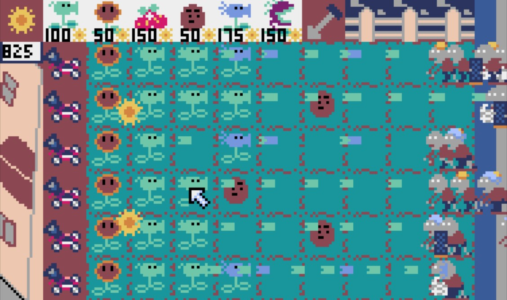
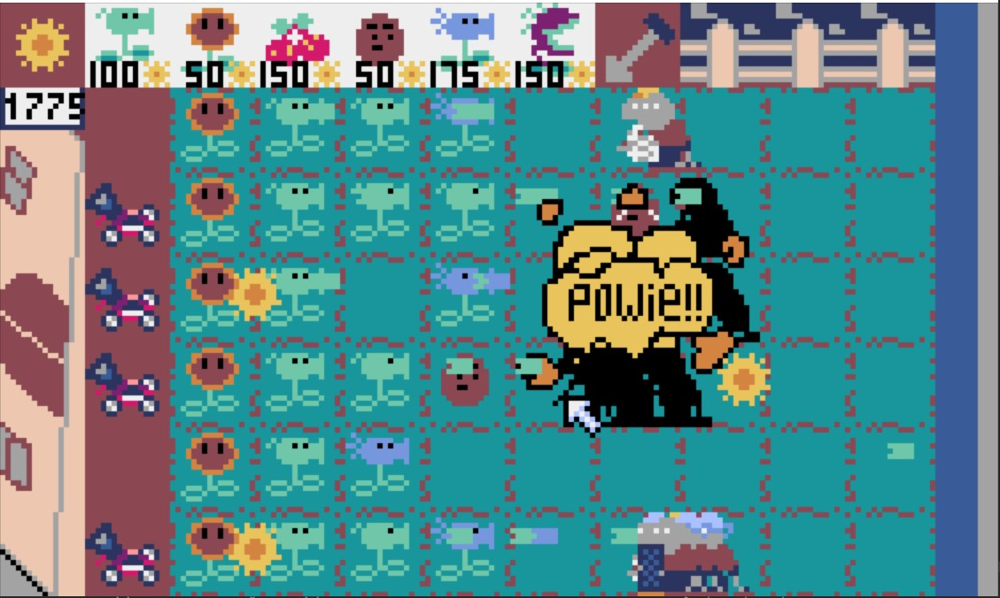
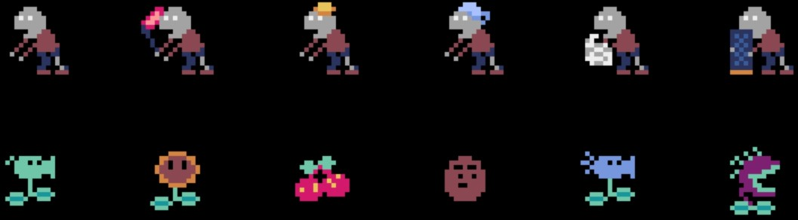

# Pyxel-Plants_vs_Zombies

[Pyxel](https://github.com/kitao/pyxel) version of the classic game: "Plants vs Zombies".

## Win / Lost
- zombies will keep coming every 30 seconds, defend as long as possible!
- Lost if zombies get into your house

## Control
- mouse
- `q` or `esc` to terminate

## Installation
- clone this repo and run main.py
- note that you also need to install [Pyxel](https://github.com/kitao/pyxel)

###### Use [Pyxel](https://github.com/kitao/pyxel) as game engine
